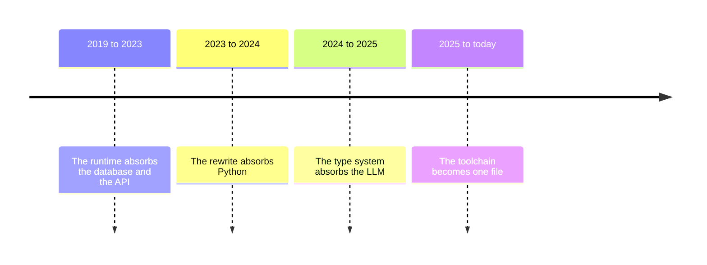

In 2019, shipping one production AI application of modest ambition required
a frontend framework, a backend framework, a database, a cache, a queue, an
API layer, a build system, and a deployment pipeline: React, FastAPI,
Postgres, Redis, RabbitMQ, Docker, Kubernetes, and a configuration format
for each. An application of this shape is a *diffuse application*: not one
program but a federation of programs (database, cache, logging, AI models,
frontend) interfacing over APIs to realize a single product. Each piece
connects to its neighbors through code that exists only to move data between
them: serializers, API client stubs, ORM mappings, and deployment manifests.
That connective code is glue code, it delivers no product functionality, and
in a typical backend there is more of it than there is application logic.

This complexity is in stark contrast to an earlier era of computing, when a
state of the art software product was a single binary that ran on one
machine and could be developed by a single programmer. The standard remedies
do not restore that simplicity. A better framework reduces the glue code you
write by hand, and a serverless platform hides the infrastructure but takes
ownership of your program to do it.

What convinced me the problem was structural is that the architecture
diagram of these systems carries more information than any single source
file. The diagram shows the whole application, and no file does. I decided
the diagram should be the program. The goal was one language that could
express a complete diffuse application: the data, the logic, the interface,
the model calls, and the deployment. I started building it at the end of
2019 as a hobby project and have worked on it every day since. The language
is called Jac. Six years later it is the only language I use, and this post
is an account of how it got there.

## The method

A six-year language project sounds like it ran on a roadmap. Mine did not.
Nothing that follows was executed against a master plan drawn in 2019. There
was one method, applied over and over: find the part of the stack that costs
the most engineering time, make it a feature of the language or its runtime,
and repeat. Each application of the method removed one class of glue code
and exposed the next one, so the history divides into four eras, and this
post walks through them in order. The four eras in one picture:



A note on authorship is owed up front. I write "I" for the early years
because the early years were solo. Jac stopped being a solo project long
ago: it is built by an open-source community that no longer fits in one
room, and commercial products ran on it years before I wrote any of this
down. From the rewrite onward the accurate pronoun is "we". The daily
application of the method is the part I can claim.

## Era 1: The runtime absorbs the database and the API (2019 to 2023)

The first system was the Jaseci runtime stack, open-sourced in 2021. Its
programming model came from taking the diagram seriously. The paradigm,
coined *data-spacial programming* at the time and later formalized as
**Object-Spatial Programming**, replaces the class-and-function view of a
program with three constructs. A *node* is data that lives in a graph. An
*edge* is a typed relationship between two nodes. A *walker* is a unit of
computation that travels through the graph, carrying its state with it and
executing at each node it lands on.

Two properties of the runtime fell out of that model. First, persistence:
any node connected to the root of the graph outlives the process, so there
is no separate database to operate, no ORM, and no migration scripts.
Second, serving: a walker can be exposed directly as an authenticated API
endpoint, so there is no web framework and no REST scaffolding to write.
The runtime also owned deployment, running the microservices, caches, and
queues underneath the program without the program mentioning them.

The stack ran real products. myca.ai, a B2C productivity platform, built
its backend in 1 month and launched to the public within 3. ZeroShotBot, a
conversational AI company, shipped its product in 2 months with frontend
engineers only, writing no traditional backend code, and was serving tens
of thousands of queries a day across about 12 business customers.
HomeLendingPal, an AI mortgage advisor, ran its production conversational
experience in roughly 300 lines of Jac, in contrast to the tens of
thousands of lines the equivalent stack normally takes. Measured across
these deployments, the runtime cut development time by roughly 10x and
eliminated close to 100% of the typical backend code.

A complete account must also record what that first stack was not. Jac 1.x
was an interpreted DSL riding on a runtime, and it delegated real
computation to Python through binding code called *actions*. The language
built to eliminate glue code required glue code to reach the ecosystem
where every library lived. The database and the API were gone, but crossing
between Jac and Python was now itself an integration layer. That
contradiction set the agenda for the next era.

## Era 2: The rewrite absorbs Python (2023 to 2024)

In 2023 we rebuilt the language from the ground up as a compiled language
whose semantics contain Python's. Jac compiles to Python bytecode and runs
on CPython, so every package on PyPI is a native import, not a binding. The
relationship between the two languages inverted. Jac 1.x reached into
Python through actions. The new Jac contains Python, and the object-spatial
constructs became extensions of a general-purpose language rather than the
whole of a special-purpose one. An existing Python codebase can adopt
nodes, edges, and walkers one file at a time.

The rewrite removed the integration layer between Jac and its ecosystem.
Two large sources of glue code were still standing: the prompt and the
toolchain.

## Era 3: The type system absorbs the LLM (2024 to 2025)

By 2024 every AI application carried a new kind of glue code that nobody
was calling glue code. A prompt is a string you compose by hand to move
data between your program and a model, and then you parse the response and
check the types yourself. Structurally it is a serializer plus a parser,
written in English. The observation that became **Meaning-Typed
Programming** is that a function signature already carries the meaning a
model needs:

```jac
import from byllm { Model }

glob llm = Model(model_name="gpt-5.2");

"""Extract the people mentioned, with their roles."""
def extract_people(text: str) -> list[Person] by llm();
```

The docstring states the intent. The parameter types and the return type
are the contract. The runtime generates the prompt from the signature,
validates the response against `list[Person]`, and retries or fails at the
call site instead of three functions later. Swapping models is a one-line
change because no call site names a vendor. The idea went through peer
review attached to the shipping implementation.

That moved the model inside the type system. The largest remaining source
of glue code was the oldest one, the one every language treats as somebody
else's problem: the toolchain.

## Era 4: The toolchain becomes one file (2025 to today)

A build system is glue code too. Package manifests, bundlers, Dockerfiles,
and Kubernetes YAML encode decisions the compiler already knows: what the
program imports, what it serves, and where it runs. So the last era pushed
the language over all of it. Jac code marked for the client compiles to
JavaScript and runs in the browser, which makes the frontend part of the
same program instead of a second repository. The same language also
compiles through LLVM to native machine code and WebAssembly. `jac start`
runs the program as a server, and one flag deploys it to Kubernetes.

This era produced two developments I did not predict in 2019. First, the
compiler became self-hosted. The compiler that ships today is written in
Jac, its passes and its type system included, and is brought up by a small
bootstrap transpiler. Second, the toolchain fused into one file. The `jac`
binary you download is a native launcher with the entire runtime appended:
a private CPython, the precompiled compiler, the Bun JavaScript runtime, a
statically linked LLVM, Jac's own linker written in Jac, and an embedded
editor. There is no npm, pip, node, docker, or gcc to install next to it.
In June 2026 the separately versioned packages converged on a single
version line, the release after that removed the plugin system, and as I
write this the current release is v0.34.

## The stack today

The 2019 stack required a dozen technologies. The current stack is one
file. For example, this is a complete persistent, served application:

```jac
node Post {
    has text: str;
}

walker create_post {
    has text: str;

    can create with `root entry {
        post = Post(text=self.text);
        here ++> post;
        report post;
    }
}
```

There is no database in this program and no API layer. The `Post` node
persists because it is connected to `root`. `jac start` exposes
`create_post` as an authenticated endpoint, and every user of the service
gets their own root, so per-user data isolation comes from the graph rather
than from WHERE clauses. When the application grows a frontend, the
frontend is written in the same language, and one command builds the whole
project into a single deployable artifact. A state of the art product is a
single binary again.

## What it cost

A record like this owes its concessions. Lock-in is real: leaving a
language costs more than leaving a library, and I consider it the strongest
argument against the whole design. Debugging changed shape: when the API
layer is generated, the tooling has to reconstruct the request path for
you, and building that machinery took years. There are programs Jac is
wrong for. The measurements above come from our own products, which is the
weakest form of evidence, and the book below reports them together with
their threats to validity. The method itself was also expensive to obey: it
demanded a ground-up rewrite of a working language, a renaming that
deprecated a shipped package, and the removal of subsystems that had taken
years to build, including the plugin architecture we had spent three years
refining.

## Irrational not to

This month I finished a book-length treatment of everything above: the
definitions, the formal semantics of Object-Spatial Programming, and the
measurements with their caveats. The book closes with a verse instead of a
conclusion. The verse states the position more plainly than the chapters
do:

> Jac is the language I've always dreamt of,
> and it has now realized its full form for me.
> I will use it forever,
> and for everything,
> it would be irrational not to.
>
> From this point on,
> I will continue to work on Jac for everyone else,
> because I love Jac
> and I want it to live forever,
>
> I won't,
>
> So it would be irrational not to.
>
> For me, it's irrational not to use Jac,
> and it's irrational not to work on Jac.
> And...
> I don't talk to irrational people.
